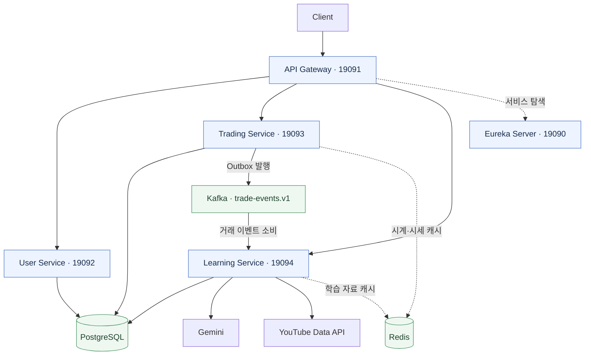

<a id="top"></a>

<div align="center">

<h1>📈 SixFin</h1>

<p><strong>매매 경험을 투자 습관으로 연결하는 모의투자 학습 플랫폼</strong></p>
<p>과거 시세 기반 모의투자 · 투자 원칙 진단 · AI 피드백 · 학습 자료 추천</p>


</div>

<p align="center">
  <a href="#서비스-소개">💡 서비스 소개</a> ·
  <a href="#주요-기능">✨ 주요 기능</a> ·
  <a href="#기술-스택">🛠️ 기술 스택</a> ·
  <a href="#시스템-구조">🏗️ 시스템 구조</a> ·
  <a href="#핵심-구현">⚙️ 핵심 구현</a> ·
  <a href="#로컬-실행">🚀 로컬 실행</a>
</p>

---

<a id="서비스-소개"></a>

## 💡 서비스 소개

**SixFin은 자신의 매매 과정을 돌아보고 투자 원칙을 연습할 수 있는 모의투자 학습 서비스입니다.**
가상 자금으로 주식을 매매하면서 계획 손절가와 투자 근거를 기록하고, 실제 거래가 그 계획에 얼마나 부합했는지 확인합니다.

거래가 발생하면 규칙 기반 진단이 손절 원칙과 추격 매수 등의 행동을 분석합니다. AI는 진단 결과와 거래 이력을 바탕으로 피드백을 작성하고, 관련 학습 자료를 연결해 다음 매매에서 참고할 수 있도록 돕습니다.

이 저장소는 **Java·Spring 기반 백엔드 모노레포**입니다. 회원, 거래, 학습 도메인과 API Gateway, 서비스 디스커버리를 포함한 5개 모듈로 구성됩니다.

| 📝 01. 투자 계획 | 📈 02. 모의 매매 | 🔎 03. 행동 진단 | 🎓 04. 피드백과 학습 |
| :--- | :--- | :--- | :--- |
| 계획 손절가·투자 근거 기록 | 과거 시세를 재생하는 가상 시장에서 매수·매도 | 거래 단계에 맞는 규칙으로 투자 행동 분석 | AI 설명과 관련 학습 자료 확인 |

<a id="주요-기능"></a>

## ✨ 주요 기능

| 영역 | 기능 | 설명 |
| :--- | :--- | :--- |
| 🔐 **회원·인증** | 회원가입, 로그인, 내 정보 조회 | JWT 발급 및 Gateway의 보호 경로 인증 |
| 🌐 **가상 시장** | 종목·시세 조회 | 수집한 과거 시세를 공통 가상 시계에 맞춰 재생 |
| 📈 **모의투자** | 시장가 매수·매도 | 주문·체결 기록, 계획 손절가·투자 근거 저장 |
| 💼 **자산 관리** | 계좌·포트폴리오·포지션 조회 | 예수금, 보유 종목, 평가 정보, 현금 원장 확인 |
| 🔎 **투자 진단** | 규칙 기반 행동 분석 | 진입·추가 거래·포지션 종료 단계에 걸쳐 8종의 규칙 적용 |
| 🤖 **AI 피드백** | 진입 피드백, 요청형 피드백, 종료 리뷰 | 진단 근거와 거래 이력을 바탕으로 매매 과정 설명 |
| 📚 **학습 자료** | 관련 콘텐츠 추천 | 진단에 맞는 자료 연결, YouTube 검색 연동 및 후보 캐시 |
| ⚙️ **운영 관리** | 가상 시계·계좌·이벤트 관리 | 시계 시작·정지·배속·초기화, 계좌 초기화, 실패 Outbox 재발행 |

<details>
<summary><strong>🔎 투자 진단 규칙 8종 보기</strong></summary>

| 단계 | 규칙 | 확인하는 행동 |
| :--- | :--- | :--- |
| 진입 | `STOP_LOSS_SET` | 매수 시 계획 손절가를 설정했는가 |
| 진입 | `STOP_LOSS_WIDTH` | 매수가 대비 손절 폭이 적절한가 |
| 진입 | `HIGH_CHASING_BUY` | 최근 20일 최고가 부근에서 매수했는가 |
| 진입 | `SHORT_TERM_SURGE_BUY` | 단기 급등 이후 매수했는가 |
| 거래 | `REPEATED_HIGH_CHASING_BUY` | 추가 매수에서도 고점 추격을 반복했는가 |
| 거래 | `SELL_BELOW_STOP_LOSS` | 계획 손절가보다 낮은 가격에 매도했는가 |
| 종료 | `STOP_LOSS_ADHERENCE` | 전체 매도 과정에서 손절 원칙을 지켰는가 |
| 종료 | `HIGH_CHASING_FREQUENCY` | 포지션 전체에서 고점 추격 매수가 얼마나 반복됐는가 |

매수 요청의 손절가와 투자 근거는 현재 구현에서 선택 항목입니다. 손절가를 입력하지 않은 경우도 진단 대상으로 처리합니다. 규칙 정의는 [RuleCode](learning-service/src/main/java/com/sparta/learning/domain/model/RuleCode.java)에서 확인할 수 있습니다.

</details>

<a id="기술-스택"></a>

## 🛠️ 기술 스택

| 구분 | 사용 기술 |
| :--- | :--- |
| ☕ **Backend** |    |
| 🔗 **Microservices** |     |
| 🗃️ **Persistence** |    |
| 💾 **Data & Messaging** |    |
| 🔐 **Security** |   |
| 🤖 **AI** |   |
| 📡 **External Data** |     |
| ☁️ **Infrastructure** |     |
| 📊 **Monitoring** |     |
| 🧪 **Test & Docs** |     |

<details>
<summary><strong>📋 기술별 버전과 사용 목적 자세히 보기</strong></summary>

버전은 저장소의 Gradle 및 Docker Compose 설정을 기준으로 작성했습니다.

| 구분 | 기술 | 용도 |
| :--- | :--- | :--- |
| 언어·빌드 | Java 21, Gradle Wrapper 9.7.1 | 멀티모듈 빌드와 테스트 |
| 프레임워크 | Spring Boot 4.1.1, Spring Cloud 2025.1.2 | 서비스 구성과 실행 |
| 서비스 연동 | Spring Cloud Gateway, Eureka, OpenFeign | API 라우팅, 서비스 탐색, 내부 HTTP 호출 |
| 데이터 접근 | Spring Data JPA, Hibernate, QueryDSL 7.5 | 도메인 저장 및 조회 |
| 데이터베이스 | PostgreSQL 17 | 거래·진단·피드백 저장, JSONB 활용 |
| 캐시 | Redis 7 | 인증 토큰, 가상 시계·시세, 학습 자료 후보 관리 |
| 메시징 | Apache Kafka 4.3.1 · KRaft | 거래 이벤트의 비동기 전달 |
| 인증 | JJWT 0.12.6, Spring Security Crypto | JWT 서명·검증, 비밀번호 해시 |
| AI | Spring AI 2.0.1, Gemini | OpenAI 호환 API를 통한 구조화 피드백 생성 |
| 외부 데이터 | Python, yfinance, pandas, YouTube Data API v3 | 시세 수집 도구와 학습 콘텐츠 검색 |
| 인프라·배포 | Docker Compose, AWS EC2·ECR·SSM, Terraform, GitHub Actions | 컨테이너 운영, 인프라 정의, 자동 배포 |
| 모니터링 | Actuator, Micrometer, Prometheus, Grafana, Zipkin 연동 | 메트릭 수집, 대시보드, 분산 추적 |
| 테스트·API 문서 | JUnit, Mockito, JMeter, springdoc-openapi 3.1.0 | 자동 테스트, 부하 측정, Swagger UI |

</details>

<a id="시스템-구조"></a>

## 🏗️ 시스템 구조



각 애플리케이션은 Eureka에 등록되며, 클라이언트 요청은 Gateway를 통해 도메인 서비스로 전달됩니다. Redis는 도표의 캐시 외에 인증 토큰 관리에도 사용합니다.

| 모듈 | 포트 | 담당 역할 |
| :--- | :---: | :--- |
| [eureka-server](eureka-server/) | 19090 | 서비스 등록 및 탐색 |
| [gateway-service](gateway-service/) | 19091 | 외부 요청 라우팅, JWT 검증, 사용자 정보 전달 |
| [user-service](user-service/) | 19092 | 회원 관리, 인증, 토큰 발급 |
| [trading-service](trading-service/) | 19093 | 가상 시장, 주문·체결, 계좌·포지션, Outbox |
| [learning-service](learning-service/) | 19094 | 이벤트 수집, 규칙 진단, AI 피드백, 학습 자료 |

현재 기본 구성은 PostgreSQL 인스턴스와 `sixfin` 데이터베이스를 공유합니다. Trading은 `trading_service` 스키마를 사용하고, User와 Learning은 별도의 스키마 지정 없이 기본 스키마를 사용합니다.

<a id="핵심-구현"></a>

## ⚙️ 핵심 구현

### 🔄 거래와 학습을 연결하는 이벤트 처리

1. **주문 검증** — `requestId`로 중복 주문을 확인하고 시세·시장 상태를 검증합니다.
2. **거래 저장** — 계좌·포지션 잠금을 적용해 예수금, 주문, 체결, 현금 원장과 Outbox 이벤트를 같은 트랜잭션에서 저장합니다.
3. **이벤트 발행** — 별도 Publisher가 Outbox를 읽어 `trade-events.v1` 토픽에 전달합니다. 사용자 키로 묶어 그룹 내 순차 발행과 그룹 간 병렬 처리를 수행합니다.
4. **진단과 피드백** — Learning이 이벤트 ID로 중복 소비를 확인하고 거래 스냅샷과 진단을 저장한 뒤 자동 피드백 생성을 요청합니다.

| 설계 항목 | 적용 방식 |
| :--- | :--- |
| 거래 정합성 | 계좌·포지션의 비관적 잠금과 주문 요청 ID의 유니크 제약 |
| 이벤트 전달 | Transactional Outbox, 발행 상태 관리 및 실패 재처리 |
| 중복 처리 방지 | 이벤트 ID·진단 키·피드백 키 기반의 중복 확인과 유니크 제약 |
| DB 연결 점유 단축 | Kafka 전송을 DB 트랜잭션 밖에서 수행하고 결과만 별도 트랜잭션으로 기록 |
| AI 작업 분리 | AI 호출과 학습 자료 연결에 각각 전용 스레드풀 사용 |
| 피드백 복구 | 작업 용량 초과로 실패하거나 오래 처리 중인 자동 피드백을 스케줄러로 재처리 |

### ⚡ 조회와 AI 입력 최적화

- **피드백 목록**: 목록에 필요한 컬럼과 JSONB 요약만 조회하고, 전체 COUNT 대신 다음 페이지 존재 여부를 확인합니다.
- **조회 인덱스**: 사용자·피드백 유형·상태 조건과 생성 시각 정렬에 맞춘 복합 인덱스를 적용합니다.
- **AI 컨텍스트**: 전체 체결 이력을 집계와 대표 거래로 구성하고, 진단도 규칙별 요약으로 전달합니다.
- **운영 지표**: 이벤트 처리, 규칙 진단, AI 호출, 학습 자료 추천 시간과 작업 큐·DB 연결 상태를 관측합니다.

<details>
<summary><strong>📊 초기 성능 검증 기록 보기 · 2026-09-16</strong></summary>

저장소에 보관된 초기 통합 테스트는 5분 동안 주문 10 VU, 시세 50 VU, 피드백 목록 10 VU를 동시에 실행했습니다. AI는 Stub을 사용했으며 실제 Gemini·YouTube 호출은 해당 측정 범위에서 제외했습니다.

| 검증 항목 | 당시 결과 |
| :--- | :--- |
| HTTP 요청 | 130,455건, 실패 0건 |
| Outbox 발행 / Learning 소비 | 18,470건 / 18,470건 |
| 진단 결과 / 기대 결과 | 33,381건 / 33,381건 |
| 자동 피드백 / Stub AI 성공 | 7,451건 / 7,451건 |

이벤트와 피드백의 수치는 **부하 종료 후 후속 DB 감사에서 확인한 최종 결과**입니다. 마지막 피드백 완료까지 부하 종료 후 약 27분 47초가 걸렸으므로, 요청 성공과 비동기 처리 지연은 구분해서 해석해야 합니다. 별도 L8 동시 생성 테스트의 HTTP 500 두 건도 당시 보고서에 기록되어 있습니다.

이 기록은 현재 코드의 재측정 결과가 아닙니다. 조건과 한계는 [초기 성능 테스트 팀 요약](tools/performance/completed-initial-tests-staging/team-share/01-team-summary.md)과 [상세 통합 분석](tools/performance/completed-initial-tests-staging/team-share/03-integrated-analysis.md)을 참고하세요.

</details>

<a id="로컬-실행"></a>

## 🚀 로컬 실행

### 1. 준비 및 환경 설정

JDK 21, Docker와 Docker Compose가 필요합니다. 시세를 직접 수집할 때는 Python 3.11 이상도 준비합니다. Gradle은 저장소의 Wrapper를 사용합니다.

루트의 [.env.example](.env.example)을 `.env`로 복사한 뒤 아래 항목을 설정합니다. 기존 `.env`가 있다면 필요한 항목만 추가합니다.

```dotenv
POSTGRES_USER=sixfin
POSTGRES_PASSWORD=change-me-local
POSTGRES_DB=sixfin

DB_HOST=localhost
DB_USERNAME=sixfin
DB_PASSWORD=change-me-local
JWT_SECRET=replace-with-your-own-random-secret-at-least-32-bytes

REDIS_HOST=localhost
KAFKA_BOOTSTRAP_SERVERS=localhost:9092
MARKET_DATA_DIR=C:/path/to/sixfin/tools/market-data-collector/out

# 로컬에서 외부 AI 호출 없이 흐름을 확인하는 설정
AI_API_KEY=local-stub-placeholder
LEARNING_AI_PROVIDER=stub
AI_STUB_ENABLED=true
YOUTUBE_SEARCH_ENABLED=false
```

`DB_USERNAME`·`DB_PASSWORD`는 PostgreSQL 계정과 맞추고, `MARKET_DATA_DIR`는 CSV가 위치한 실제 절대 경로로 바꿉니다. `JWT_SECRET`은 User와 Gateway에서 동일한 32바이트 이상의 값을 사용합니다. 위 비밀번호와 키는 로컬 설명용 예시입니다.

실제 AI 피드백을 사용하려면 `LEARNING_AI_PROVIDER=gemini`, `AI_STUB_ENABLED=false`와 유효한 `AI_API_KEY`를 설정합니다. Stub에서도 Spring AI 초기화에 필요한 API 키 설정값은 비워두지 않습니다. YouTube 검색은 `YOUTUBE_SEARCH_ENABLED=true`와 `YOUTUBE_API_KEY`를 함께 설정하면 활성화됩니다.

### 2. 로컬 인프라 실행

프로젝트 루트에서 실행합니다.

```bash
docker compose up -d
docker compose ps
```

PostgreSQL, Redis, Kafka, Kafka UI, Prometheus, Grafana가 실행됩니다. Spring 애플리케이션은 다음 단계에서 별도로 실행합니다.

새 PostgreSQL 볼륨의 첫 기동 시 [trade.sql](infra/postgres/trade.sql)이 자동 적용됩니다. 기존 볼륨에 Trading 테이블이 없다면 다음 명령으로 적용합니다.

```bash
docker compose exec postgres sh -c 'psql -v ON_ERROR_STOP=1 -U "$POSTGRES_USER" -d "$POSTGRES_DB" -f /docker-entrypoint-initdb.d/trade.sql'
```

### 3. 시세 데이터 준비

[시세 수집 도구 안내](tools/market-data-collector/README.md)에 따라 CSV를 준비하고 `MARKET_DATA_DIR`에 아래 파일을 둡니다.

```text
tools/market-data-collector/out/
├── stocks.csv
├── daily_candles.csv
└── price_candles.csv
```

현재 구현의 `MarketDataCsvLoader`는 Trading 기동 시 실행되며, 데이터가 없는 테이블에 CSV를 적재합니다. 별도의 `init` 프로필은 필요하지 않습니다. CSV는 Git 관리 대상에서 제외되어 있습니다.

가상 시계의 `market.clock.start-seq`·`end-seq`는 준비한 데이터 범위에 맞춰야 합니다. 특히 시작 seq의 캔들과 매수 진단에 필요한 시세 지표가 있어야 정상적으로 거래할 수 있습니다.

### 4. 애플리케이션 실행

Docker Compose의 `.env` 로딩은 `bootRun`에 자동 전달되지 않습니다. **서비스를 실행할 각 터미널에서** 아래 환경 설정을 먼저 적용합니다. 명령은 프로젝트 루트에서 실행하며, `bootRun`의 작업 디렉터리는 각 모듈이므로 `../.env`를 참조합니다.

**Windows PowerShell**

```powershell
$env:SPRING_CONFIG_IMPORT = 'optional:file:../.env[.properties]'
```

아래 명령을 각각 별도 터미널에서 실행합니다. Eureka를 먼저 기동한 뒤 나머지 서비스를 실행합니다.

```powershell
.\gradlew.bat :eureka-server:bootRun
.\gradlew.bat :gateway-service:bootRun
.\gradlew.bat :user-service:bootRun
.\gradlew.bat :trading-service:bootRun
.\gradlew.bat :learning-service:bootRun
```

<details>
<summary><strong>💻 macOS / Linux 실행 명령</strong></summary>

각 터미널에서 프로젝트 루트로 이동하고 환경 설정 후 해당 서비스의 명령을 실행합니다.

```bash
export SPRING_CONFIG_IMPORT='optional:file:../.env[.properties]'

./gradlew :eureka-server:bootRun
./gradlew :gateway-service:bootRun
./gradlew :user-service:bootRun
./gradlew :trading-service:bootRun
./gradlew :learning-service:bootRun
```

</details>

Trading은 기동할 때 가상 시계를 `STOPPED` 상태로 초기화합니다. 주문을 체결하려면 관리자 권한으로 `POST /api/trading/internal/market/clock/start`를 호출해 시장을 시작해야 합니다. 보호된 API는 Gateway에 로그인으로 발급받은 `Authorization: Bearer <accessToken>`을 전달합니다.

### 🔍 접속 및 확인

| 대상 | 주소 |
| :--- | :--- |
| API Gateway | [localhost:19091](http://localhost:19091) |
| Eureka 대시보드 | [localhost:19090](http://localhost:19090) |
| User API 문서 | [Swagger UI](http://localhost:19092/swagger-ui.html) |
| Learning API 문서 | [Swagger UI](http://localhost:19094/swagger-ui.html) |
| Kafka UI | [localhost:8080](http://localhost:8080) |
| Prometheus | [localhost:9090](http://localhost:9090) |
| Grafana | [localhost:3000](http://localhost:3000) · 초기 계정 `admin / admin` |

Trading과 Learning의 상태 및 메트릭은 각 서비스의 `/actuator/health`, `/actuator/prometheus`에서 확인합니다. Grafana의 서비스별 대시보드는 [프로비저닝 설정](infra/grafana/provisioning/)으로 등록됩니다. Zipkin 수집기는 기본 Compose에 포함되어 있지 않으므로 분산 추적을 수집하려면 별도로 준비해야 합니다.

빌드와 테스트는 CI와 동일하게 다음 명령을 사용합니다.

```powershell
.\gradlew.bat build
```

macOS / Linux에서는 `./gradlew build`를 사용합니다.

<a id="배포-및-운영"></a>

## ☁️ 배포 및 운영

- **CI**: `develop`·`main` 대상 Pull Request에서 JDK 21로 `./gradlew build`를 실행합니다.
- **배포**: `main` push 시 애플리케이션을 빌드하고 Docker 이미지를 ECR에 게시한 뒤, SSM Run Command로 App EC2에 배포 명령을 전달합니다. AWS 인증에는 OIDC를 사용합니다.
- **인프라**: Terraform으로 VPC, App·Data EC2, ECR 및 관련 권한을 정의합니다.
- **운영 구성**: 애플리케이션은 `docker-compose.app.yml`, 데이터·관측 계층은 `docker-compose.data.yml`로 나눕니다.

배포용 Compose는 EC2 주소와 컨테이너 네트워크를 전제로 합니다. 로컬 개발에는 기본 `docker-compose.yml`을 사용합니다. 상세 흐름은 [CI 설정](.github/workflows/ci.yml), [배포 워크플로](.github/workflows/deploy.yml), [배포 스크립트](.github/workflows/deploy.sh)에서 확인할 수 있습니다.

<a id="저장소-구조"></a>

## 📂 저장소 구조

```text
sixfin/
├── eureka-server/             서비스 등록·탐색
├── gateway-service/           라우팅·인증
├── user-service/              회원·토큰
├── trading-service/           가상 시장·주문·자산·Outbox
├── learning-service/          진단·AI 피드백·학습 자료
├── tools/
│   ├── market-data-collector/ 시세 CSV 수집 도구
│   └── performance/           부하 테스트 도구·측정 기록
├── infra/
│   ├── postgres/             초기화 SQL
│   ├── grafana/              대시보드·프로비저닝
│   └── terraform/            AWS 인프라 정의
├── docs/                     Git 컨벤션
├── .github/workflows/        CI·배포 자동화
├── docker-compose.yml        로컬 인프라
├── docker-compose.app.yml    배포용 애플리케이션
└── docker-compose.data.yml   배포용 데이터·관측 계층
```

비즈니스 서비스는 `presentation → application → domain`을 중심으로 구성하고, 데이터 저장·메시징·외부 API 구현은 `infrastructure`에 둡니다. 공통 응답과 예외 등 서비스 내부 공통 코드는 `global`에서 관리합니다.

<a id="팀"></a>

## 👥 팀

**Team6-SixFin**

[@aa04260](https://github.com/aa04260) · [@choipg2684](https://github.com/choipg2684) · [@tycoon114](https://github.com/tycoon114) · [@joonseo21](https://github.com/joonseo21) · [@kuyhxl](https://github.com/kuyhxl) · [@Anhagu](https://github.com/Anhagu)

협업 규칙은 [Git 컨벤션](docs/git_convention.md)을 참고하세요.

---

<p align="center"><a href="#top">⬆️ 맨 위로</a></p>
